# Introduction

This experiment has been accepted as a poster to [GECCO
2024](https://gecco-2024.sigevo.org/). Unfortunately, I had to leave out most
of the discussion analyzing my results to satisfy the submission length
requirements, so I'm including that material here.

The main takeaway from this work is that a meta-evolutionary algorithm with
this sort of design is capable of optimizing for many different fitness
functions without being manually reconfigured to suit any of them. It seems to
do this by automatically discovering effective search strategies that are able
to get traction on whatever task is at hand. As such, the focus of this
analysis will be the qualitative and quantitative features of the searches that
the algorithm discovered for each of the eight fitness functions, and their
performance.

Perhaps the most notable finding is just how diverse the strategies and evolved
phenotypes are, and how different the evolutionary dynamics can be between
the inner and outer loops, and across different fitness functions. For those
that are interested in exploring the full diversity of results, there's even
more data like this in the `gp_variations` directory, which is from an earlier
iteration of the same experiment. This analysis will focus on the results in
the `paper` directory, which were used to write the paper.

In this project, every fitness function evaluates a Game of Life simulation,
looking for ones with "interesting" properties, usually by looking at just one
or a few frames of the simulation video. The functions are pretty arbitrary,
chosen mostly just to have a diverse set of tasks within a single domain. For
full details of these functions, see [the implementation](https://github.com/ngaylinn/epigenetic-gol-v1/blob/main/kernel/fitness.cu).

Fitness Functions:
- [ENTROPY](#entropy): Prefer simulations where the first and last frames
  cannot be efficiently compressed.
- [EXPLODE](#explode): Prefer simulations with few live cells in the first
  frame and many live cells in the last frame.
- [LEFT_TO_RIGHT](#left-to-right): Prefer simulations with live cells mostly on
  the left in the first frame, and mostly on the right in the last frame.
- [RING](#ring): Prefer simulations where the last frame has as many live cells
  forming a ring shape, and few live cells outside of that shape.
- [STILL_LIFE](#still-life): Prefer simulations that end with many live cells
  that are unchanging from frame to frame.
- [SYMMETRY](#symmetry): Prefer simulations where the last frame is symmetrical
  when flipped horizontally or vertically.
- [THREE_CYCLE](#three-cycle): Prefer simulations that end with many cells
  oscillating with a period of three.
- [TWO_CYCLE](#two-cycle): Prefer simulations that end with many cells
  oscillating with a period of two.

# Entropy

This experiment produced simulations that look very much like white noise.
That's a very striking result, because the algorithm that made those
simulations was chosen for its ability to create patterns with structure,
symmetry, and repetition. It wasn't obvious it was even capable of producing
such random-looking patterns. It was able to do so by composing multiple
complex patterns over top of each other using an XOR operation. This is
actually quite similar to a common technique software engineers use to produce
pseudorandom numbers.

The outer loop of this algorithm evolves a GP map, which can also be thought of
as a constrained search space over Game of Life simulations. Here is one
example of an evolved search space for the `ENTROPY` fitness function:

These are an example of an initial population that would be further evolved by
the inner loop. The range of patterns shown here is representative of the
search space the inner loop will traverse. Notice that while there is still a
pretty wide range of patterns, they are all restricted to medium-density,
irregular, space-filling patterns. Some are more or less random looking than
others. The inner loop is able to search through these to find the most fit
examples, like this one:

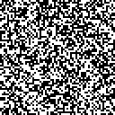

You can see that the GP map evolved to find a more fruitful search space for
the inner loop in two different ways. This chart shows how the performance of
the outer loop improves over time. Note that the fitness of the outer loop has
nothing to do with the chosen fitness function, but rather the ability of the
inner loop to adapt to whatever the fitness function is.

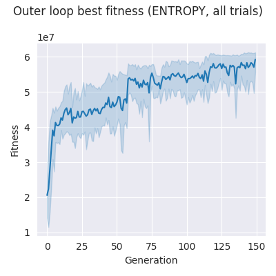

It's also interesting to look at the performance of the inner loop searching
for a fit genotype, as the GP map it uses evolves:

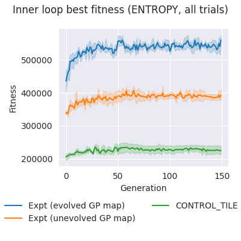

In this case, the inner loop is barely able to evolve at all using the control
GP map, showing it is a poor fit for this fitness function. It is able to do
much better by picking the best from a set of random GP maps (orange), and far
better still with a GP map optimized for the `ENTROPY` fitness function.

It's interesting to see how fitness in the outer loop grows quite sharply at
first, then continues to grow over time. This suggests the outer loop was able
to eliminate large swaths of the search space as unfruitful early on, and was
able to gradually narrow the search space further over time. In contrast, the
inner loop shows a healthy growth in fitness that quickly flattens out. This
suggests that the evolved GP map narrows the search space so far that the
challenge of finding a fit phenotype is dramatically reduced for the inner loop
and leaving it relatively little work to do. This is *not* the case for all
fitness goals.

# Explode

The results of this experiment are interesting because the outer loop found two
distinct search strategies, using very different GP maps. The first strategy is
what I expected to see, placing small, dense clusters of live cells into the
world, looking for tiny patterns that happen to grow into large, chaotic,
space-filling patterns:

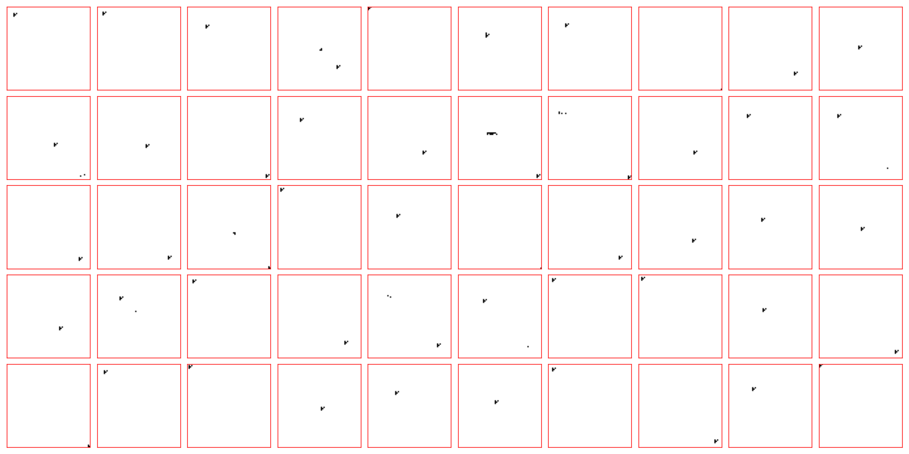

In other iterations of the same experiment, the outer loop instead found a
completely different strategy, instead drawing patterns of one-cell-wide lines
that span the whole world:

One quirk of the Game of Life rule set is that lines like this form chaotic
patterns that spread and repeat indefinitely, producing simulations like this
one which got the highest score for this fitness function:

Note that it's just luck that the initial conditions produce a large number of
alive pixels in the last frame. This strategy depends on having several
attempts to get lucky in that way.

Again, we see that the GP map itself was able to evolve very well, adapting to
suit the fitness function. But by doing so, it ended up becoming so specialized
that the best phenotype was inevitable. The inner loop found it immediately,
and was unable to improve upon it over many generations. This is in contrast to
the unevolved GP map, which showed more healthy evolution in the inner loop,
though it began from a less-fit starting point, and reached much lower final
fitness.

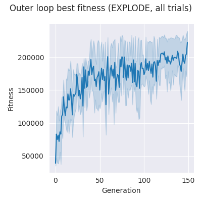
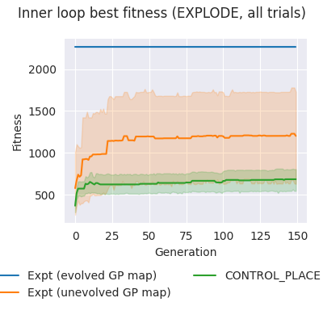

# Left to Right

The evolved search strategies for the `LEFT_TO_RIGHT` fitness function tended
to focus on various ways of filling large areas of space, so that the first
frame can be close to the ideal: all live cells on the left, all dead cells on
the right. There seems to be much less concern for the last frame, which
makes sense, since the algorithm has much more influence on the first frame
(which it can draw directly) and the last (which depends on how the initial
conditions unfold over 100 time steps).

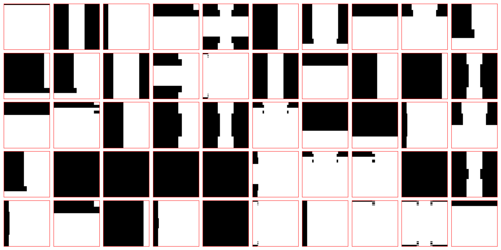

What's striking about this fitness function is the strong, steady upwards
trajectory of the outer loops fitness growth. This is in sharp contrast with
the inner loop, which is barely able to evolve at all, no matter which GP map
it works with.

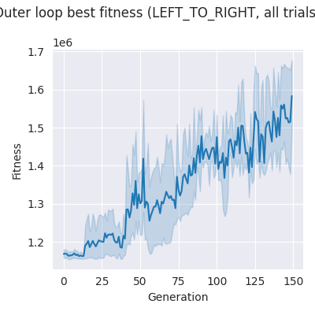
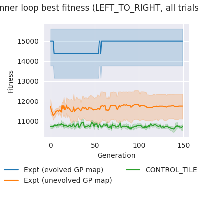

This is likely because the inner loop is responsible for evolving fine detail,
which doesn't matter so much in this case. Anecdotally, in early development,
this algorithm was able to produce dynamic patterns that "moved" from left to
right by exploiting the Game of Life rules, but this was quite rare, and
actually got lower fitness scores than the later solutions. Those simulations
were relatively simple, just densely filling space to get as close as possible
to a "perfect score" on the first frame of the simulation. This is relatively
easy to do with the right GP map, but such maps actually hide the fine details
evolved by the inner loop, usually by stretching them until single cells are
enormous, or repeating the pattern with a tiny offset, effectively "smearing"
the details into a world-spanning streak. This explains why mutations in the
inner loop rarely made a difference and fitness generally did not improve.

# Ring

The `RING` fitness function was one of the most difficult for this algorithm,
for the simple reason that it's hard to design initial conditions for a
cellular automaton that will produce the desired pattern in the final step. It
seems like the best strategy in this case is to lay out large chunks of live
cells roughly in the shape of the target, then tweaking that pattern until it
persists until the last frame of the simulation. Here I include a sample from
one of the earlier experiments, because it shows the pattern more clearly:

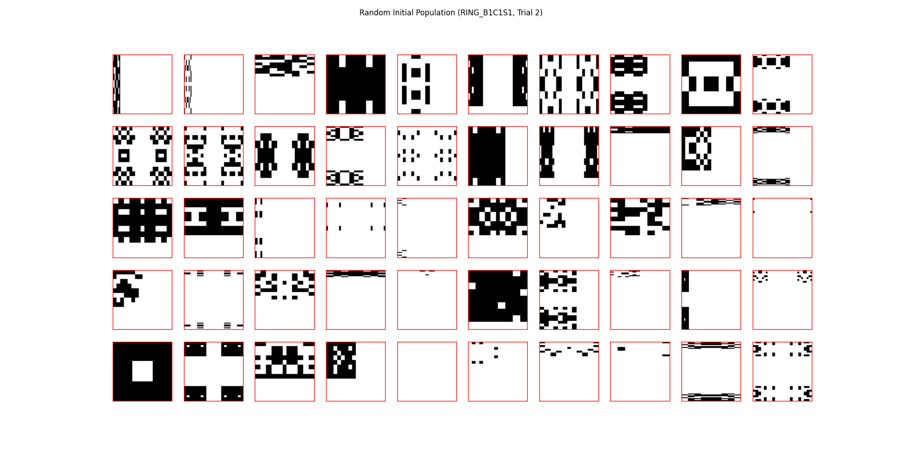

This produced a Game of Life simulation with a clear but fuzzy ring pattern
visible in the final frame:

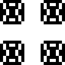

The final version of this experiment as referenced in the paper found a similar
strategy, but it was less successful in refining it, and produced less impressive
results (though they do have a similar quality):

This is probably just a matter of luck. The better strategy showed up very
rarely, which is why it was found just a handful of times during development
but wasn't replicable in the final attempt.

Again, we see a pattern of evolutionary improvement similar to the
`LEFT_TO_RIGHT` scenario, where the gross structure of the design matters more
than its fine detail. We see that the outer loop is able to evolve effectively,
while the inner loop has very little fitness improvement:

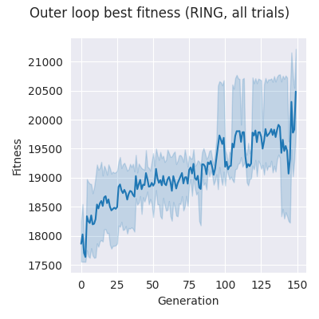
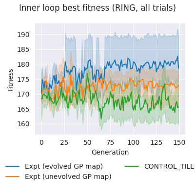

It's interesting just how noisy the fitness curve is for the inner loop here.
This reflects the chaotic nature of trying to design initial conditions that
will result in an interesting end result. It's also notable how the evolved GP
map not only improves overall fitness, but seems to make the problem more
*tractable* for the inner loop. Notice that fitness actually trends *downward*
for the control GP map, while it tends slightly *upward* using the evolved one.

# Still Life

GP maps evolved to the `STILL_LIFE` fitness function search over patterns
densely packed with fine detail and tiled to fill the simulation world. For
example:

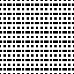

What's most interesting about that is how each evolutionary run produced
somewhat different search patterns of that kind. For instance, this one has
relatively "chunky," staggered patterns:

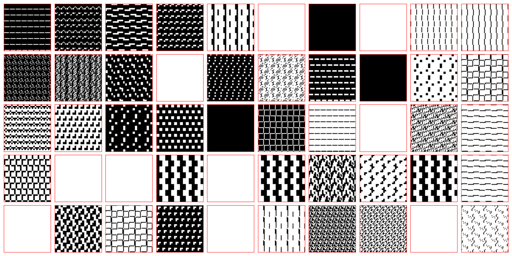

This one has very dense symmetrical patterns:

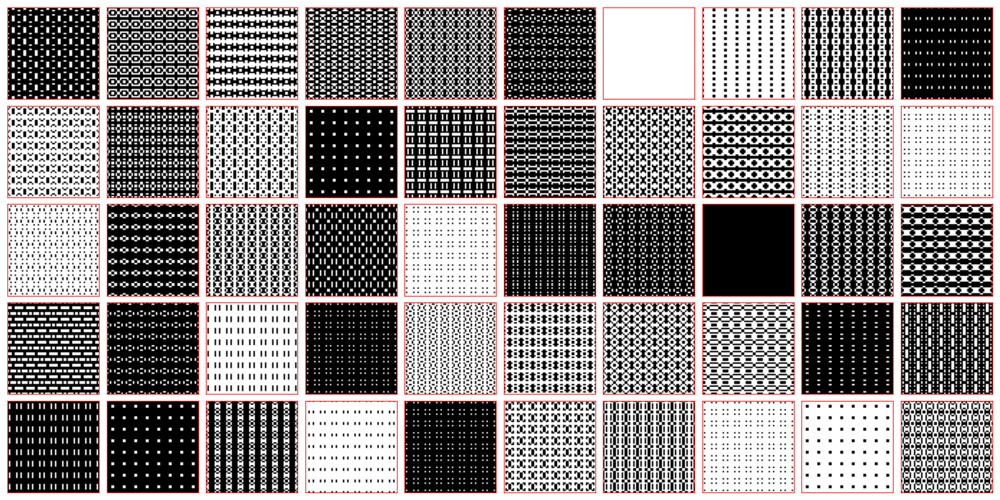

And this one uses just a few fine-scale patterns, transformed in different
ways, with a little extra noise mixed in:
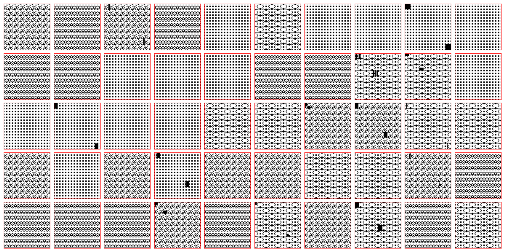

In this case, we see that the outer loop shows very rapid improvement in
fitness that gradually levels out, indicating healthy evolution. In contrast,
the outer loop is barely able to get traction on the problem. Its success is
almost completely determined by the GP map it has to work with:

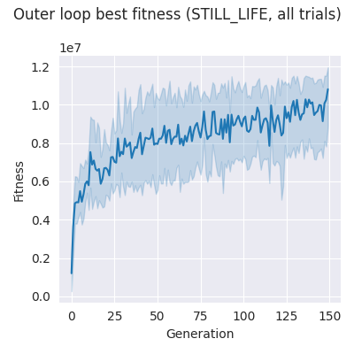
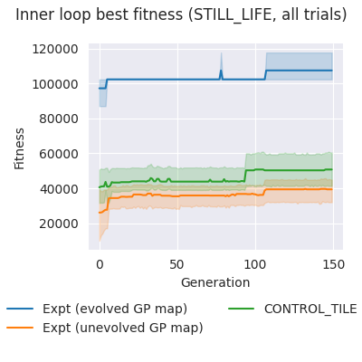

This suggests that the fitness landscape is relatively sparse and rugged, with
few fine-scale patterns that are particularly fit, and few paths of neutral
mutations linking those islands of fitness. The algorithm is able to get a high
score overall by choosing a GP map that focuses the search over ways to fill
space efficiently and constrain the fine-scale patterns to sub-spaces that are
more fruitful.

# Symmetry

The `SYMMETRY` fitness function produced results in some sense similar to
`EXPLODE` and to `STILL_LIFE`, but in different ways. The most successful
phenotypes in this experiment include patterns of lines that span the whole
world. Much like in the `EXPLODE` case, the strategy seems to generate
persistent, wide-scale patterns of chaotic activity such that the last frame of
the simulation video will have many live cells.

In this case, those cells must be arranged symmetrically, but this is easily
accomplished by having a symmetrical initial state. Interestingly, the outer
loop found a few different ways to do that, for example this GP map
specifically searched over patterns of horizontal lines, many of which were
symmetrical:

Whereas this GP map searched over symmetrical, tiled patterns

This eventually resulted in finding one tiled pattern that collapsed into a
symmetrical pattern of wold-spanning lines:

Like in the `STILL_LIFE` case, most of the evolution happened in the outer
loop, while the inner loop struggled to evolve at all, and had its success
mostly determined by the GP it used, likely for similar reasons:

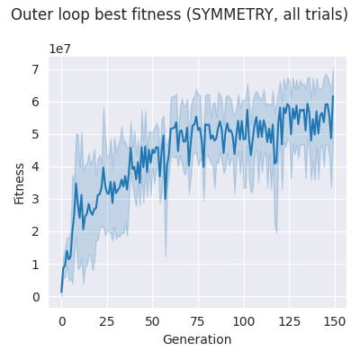
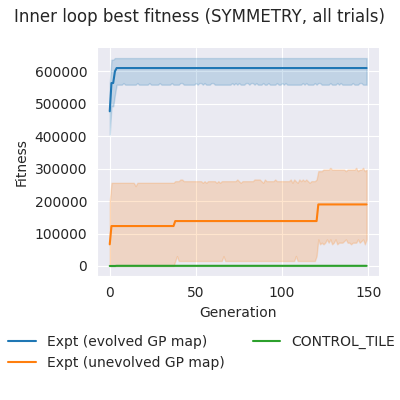

# Three Cycle
Evolved GP maps for the `THREE_CYCLE` fitness goal tended to emphasize
repeating a single pattern multiple times, with plenty of space between
instances. This one mirrors the same pattern into all four corners:
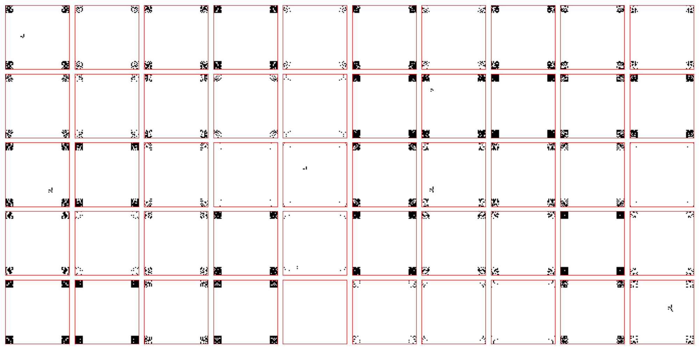

While this example laid out patterns in two rows of three:
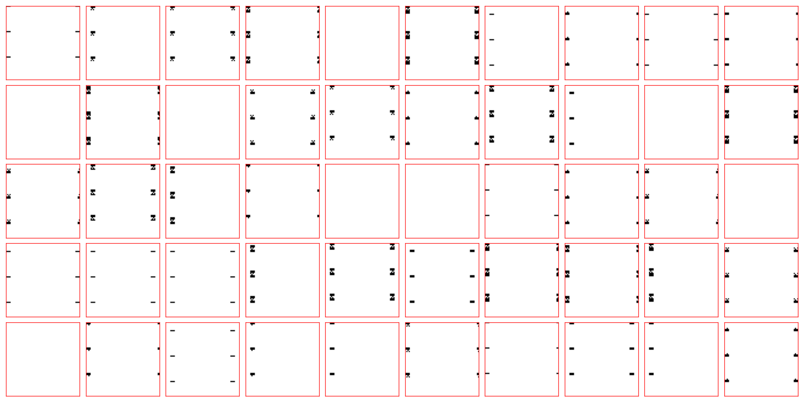

The reason for this is that the simplest and easiest to discover
period-three oscillator is a [Pulsar](https://conwaylife.com/wiki/Pulsar),
which is too big to fit into one of the 8x8 stamps evolved by the inner loop of
this algorithm. That means a tiling strategy, like was evovled for `TWO_CYCLE`,
does not work here. Instead, success in this case mostly comes from finding
creative ways to squeeze in more copies of the pulsar pattern, without
overcrowding. For example:

Interestingly, this fitness function produced relatively healthy evolution in
both the outer loop and inner loop.

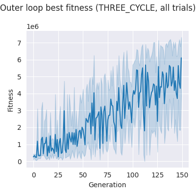
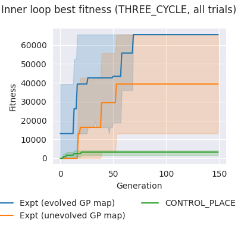

This seemingly reflects the dual challenges of having to evolve an 8x8
pattern that will unfold into a 15x15 pulsar *and* finding a global arrangement
of that pattern that allows multiple copies that don't interfere with each
other. It seems like the evolved GP map might play a supporting role in both
searches.

# Two Cycle

The `TWO_CYCLE` fitness function is similar to `TWO_CYCLE`, except there are
many more simple period-two oscillators to discover, and they tend to be quite
small, meaning it is possible to tile space with them quite densely:

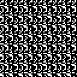

For this reason, the evolved GP maps look quite different than what we see for
`THREE_CYCLE`, generally focused on filling space with relatively dense tiled
patterns:

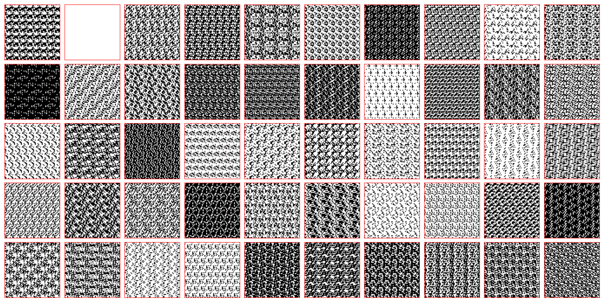

In this case, the outer loop is only able to achieve moderate fitness growth
over time, and that growth is quite noisy. By contrast, evolution in the inner
loop is more robust, and seems to play an important role for this fitness
function. This is quite different from the `THREE_CYCLE` case. Most likely,
this is because the ideal search strategy is simpler, and finding good
fine-scale patterns is both important for success and relatively easy for the
inner loop. The evolved GP map starts the search in more fruitful territory and
is able to evolve greater fitness faster, but even the unevolved and control GP
maps were relatively successful.

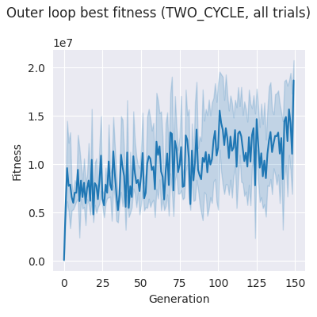
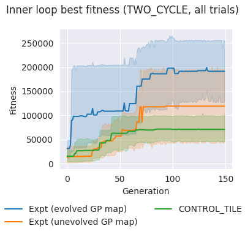
